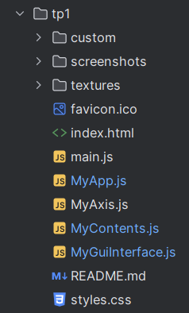
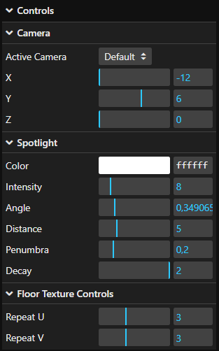
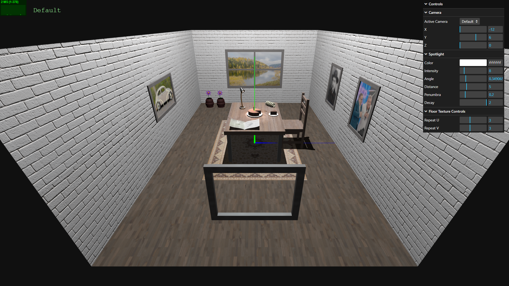

# SGI 2024/2025 - TP1

## Group T07G07
| Name             | Number    | E-Mail             |
| ---------------- | --------- | ------------------ |
| Pedro Paixão     | 202008467 | up202008467@up.pt  |
| Diogo Santos     | 202108747 | up202108747@up.pt  |

----
## Project structure

Inside the **tp1** folder, we can find essential files for a **THREE.js** computer graphics project such as **index.html**, **main.js**, **MyApp.js**, **MyContents.js**, etc.

This folder also has three subdirectories:

- **custom/**: This folder contains all the code for the custom scene objects that we created using the THREE.js library tools.
- **textures/**: This folder holds all the textures applied to the different materials in the scene.
- **screenshots/**: This folder contains all the relevant screenshots of the project.

----
## Project information

### GUI Interface

This simple GUI interface lets the user:

- choose between a set of cameras and personalize their position.
- adjust the properties of the spotlight placed in the table.
- adjust the repeat u/v properties of the texture applied to the floor.

### Scene

#### Overview

