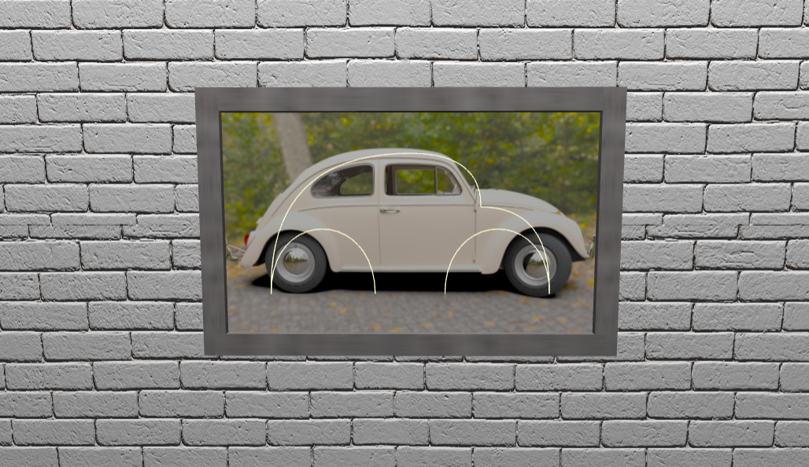

# SGI 2024/2025 - TP1

## Group T07G07
| Name             | Number    | E-Mail             |
| ---------------- | --------- | ------------------ |
| Pedro Paixão     | 202008467 | up202008467@up.pt  |
| Diogo Santos     | 202108747 | up202108747@up.pt  |

----
## Project structure

Inside the **tp1** folder, we can find essential files for a **THREE.js** computer graphics project such as **index.html**, **main.js**, **MyApp.js**, **MyContents.js**, etc.

This folder also has three subdirectories:

- **custom/**: This folder contains all the code for the custom scene objects that we created using the THREE.js library tools.
- **textures/**: This folder holds all the textures applied to the different materials in the scene.
- **screenshots/**: This folder contains all the relevant screenshots of the project.

----
## Project information

### GUI Interface

This simple GUI interface lets the user:

- choose between a set of cameras and personalize their position.
- adjust the properties of the spotlight placed in the table.
- adjust the repeat u/v properties of the texture applied to the floor.

### Scene

#### Overview

In this scene, we aim to recreate a modern-style room characterized by predominantly neutral colors.

#### Floor and Walls

The floor and walls use simple 2D planes as their base geometry. The floor material features a modern dark wood tile texture, adding depth and richness, while the walls have a white brick texture that brings subtle detail and contrast to the room's neutral palette.

#### Table

The table is constructed with four cylindrical legs that use a plain, diffuse grey material, providing a sturdy yet minimalist look. The tabletop itself is a box geometry with a raw wooden texture, giving it a warm contrast against the legs and adding a natural element to the scene.

#### Plate, Cake and Candle

The plate is represented by a simple, thin white cylinder. The cake, an incomplete cylinder, features two textures: one for the exterior and another for the interior, creating a layered effect. The candle is a slim white cylinder capped with an orange cone and a weak point light, simulating a subtle, realistic flame.

#### Paintings

The paintings are 2D planes with textures applied to simulate artwork. Each painting has a frame created by four elongated boxes with a grey wooden texture.

#### Beetle

The beetle piece is a artwork created with white geometric lines forming a beetle shape. This shape is achieved by quadratic and cubic Bezier curves. The photograph background and frame resemble those of the paintings, enhancing its decorative quality.

#### Spiral Spring

The spiral spring uses a simple diffuse white cream material. The line geometry itself is a CatmullRomCurve which points are generated by trigonometric functions, producing a smooth, coiled spring shape. Tube geometry forms the main spiral, and sphere caps are added to each end for a polished look.

#### Newspaper

The newspaper consists of four different textures, each representing a page. The slightly curved appearance is achieved by adjusting the U and V parameters of the surface, giving the impression of a loosely opened newspaper.

#### Spotlight

The spotlight consists of several parts: a cylindrical base, a curved tube pole formed with a cubic Bezier curve, a spherical bulb, and a cover cylinder with differing radius at each end. The light source itself is a directional white light placed at the bulb’s location, angled toward the cake.

#### Jar and Flowers

The flowers consist of a stem, receptacle, and petals. The stem is created using a CatmullRomCurve for a natural curve, the receptacle is a small sphere, and the petals are thick, curved triangular shapes, each with a unique color applied to the material. The jar is built with smooth, curved surfaces controlled by U and V parameters and has a dark brown color for a subtle, earthy tone.

#### Extras: Chair, Carpet and Badge

The chair is constructed from a series of box geometries in varying shapes and sizes, arranged to give it a classic and sturdy appearance. It shares the same wooden texture as the tabletop, providing a cohesive look within the room.
The carpet is represented by a simple 2D plane with a retro-patterned texture, adding a nostalgic touch to the room's overall aesthetic.
The badge resembles a framed painting but displays a football team’s emblem instead. It consists of a textured 2D plane with a surrounding frame similar to the other artwork in the scene.
