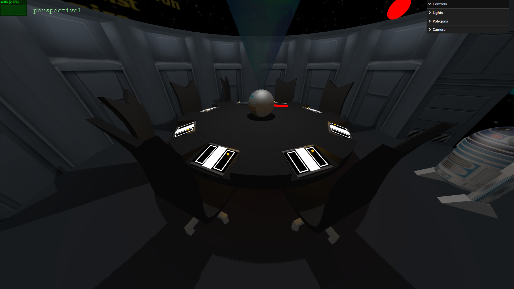

# Group T07G07 - SW IV New Hope Recreation

- Pedro Paixão - 202008467
- Diogo Santos - 202108747

# Scene Description

Our scene is based one an iconic scene from the first Star Wars movie. It has two point lights, a space background, a opening scrawl, a battle station ( Death Star) and a planet ( Alderaan ). The final scene will probably not be a full Star Wars scene, nor only in space. 

# Rendered Images:

   Current Version

Places to get more textures:

https://www.google.com/imgres?imgurl=https%3A%2F%2Fi.pinimg.com%2Foriginals%2Fd1%2F60%2F3d%2Fd1603d3b75350a2f28704f88869feffc.jpg&tbnid=5yh367sw50HNsM&imgrefurl=https%3A%2F%2Fmx.pinterest.com%2Fdanoctrejo%2Fpantalla-star-wars%2F&docid=7vh6PegAIZpcXM&w=720&h=367&itg=1&q=death+star+inside+texture

https://www.google.com/imgres?imgurl=http%3A%2F%2Fi.imgur.com%2FRC9njIk.jpg&tbnid=6LXmkqobYKPFnM&imgrefurl=https%3A%2F%2Fwww.emito.net%2Fl%2Fhttp%2F2028.happyvalentinesday2020.online%2Fdeath-star-inside%2F&docid=M8r_civmp4lB1M&w=1920&h=1200&itg=1&q=death+star+inside+texture