# SGI 2024/2025 - TP3

## Group T07G07

| Name             | Number    | E-Mail             |
| ---------------- | --------- | ------------------ |
| Pedro Paixão     | 202008467 | up202008467@up.pt  |
| Diogo Santos     | 202108747 | up202108747@up.pt  |

----
## Project Description

Our scene is a simple race of ballons. It includes a menu, a track, a goal line, four obstacles, three powerups and one sun. 

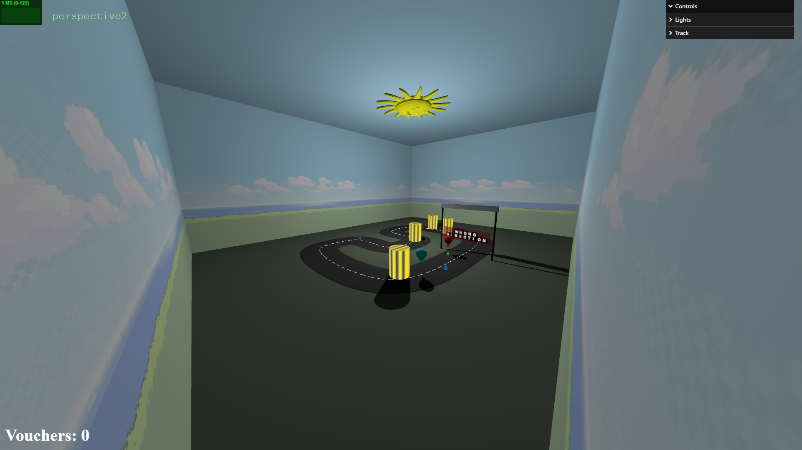

 # Controls:
- W - raise the balloon
- S - lower the balloon
- Space - pause / unpause
- 1 - first person camera
- 2 - third person camera (default)
- 3 - free-roam camera
- ESC - return to menu

# Initial Menu

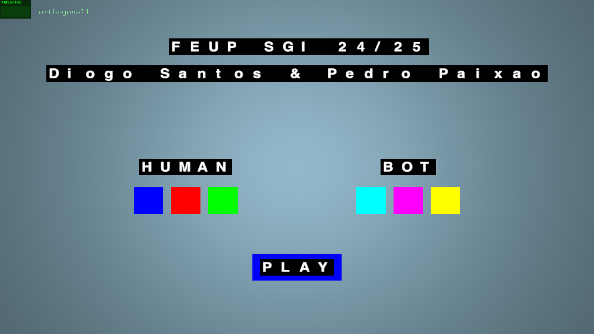

# Race Start

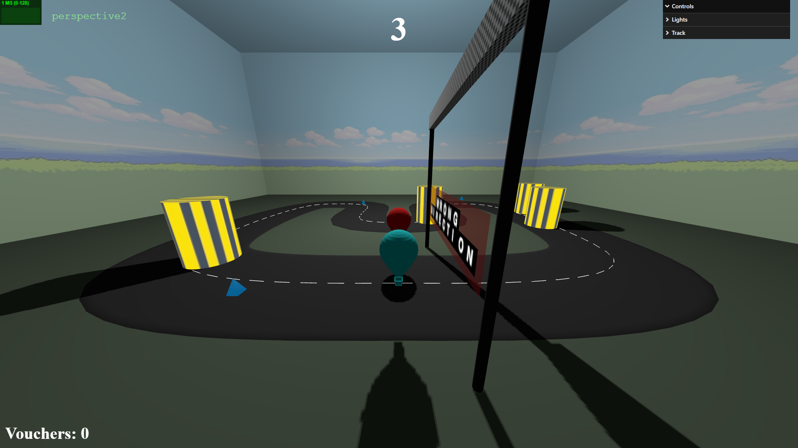

# First Person Camera

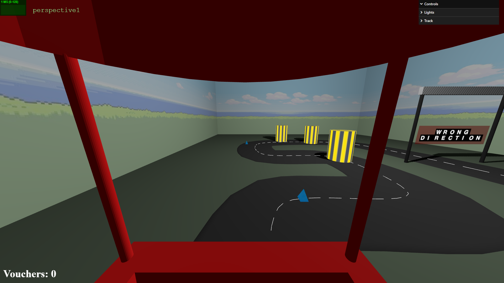

# Third Person Camera

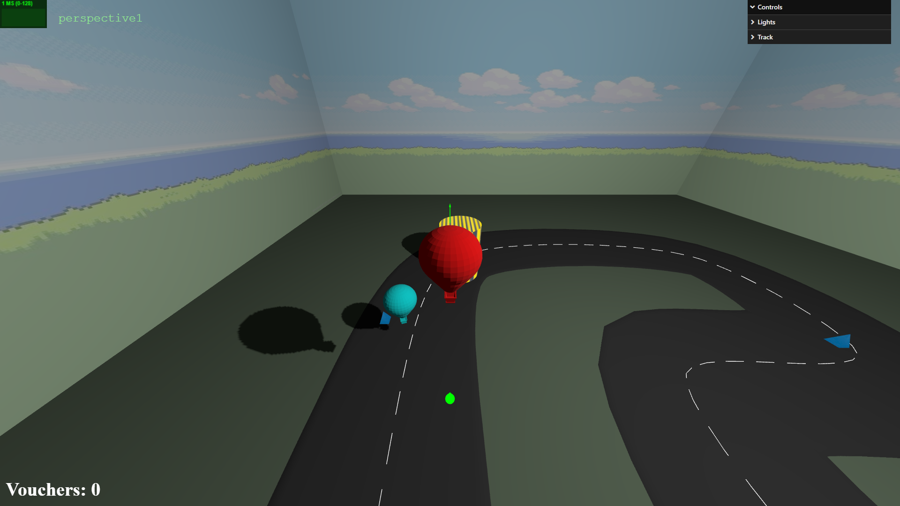

# Off Track

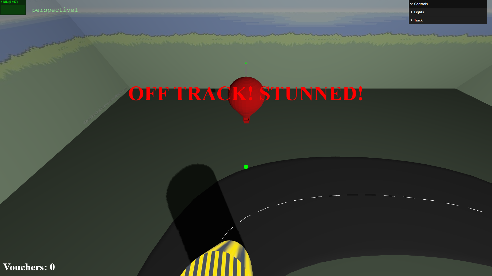

# Collision with Obstacle 

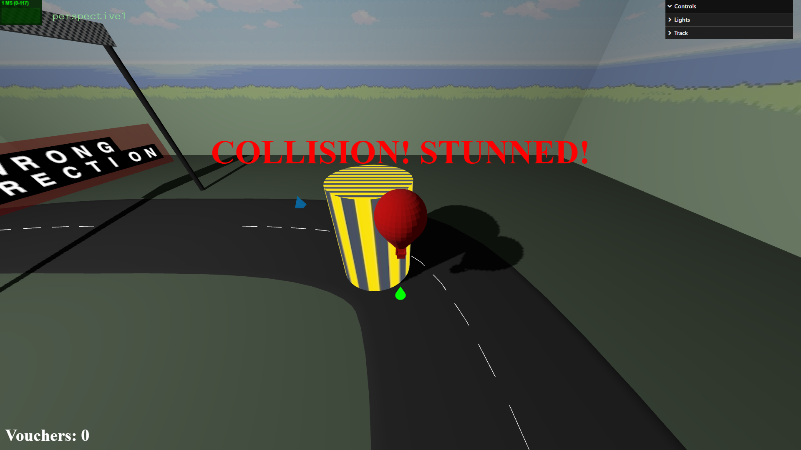

# Picking  Power up

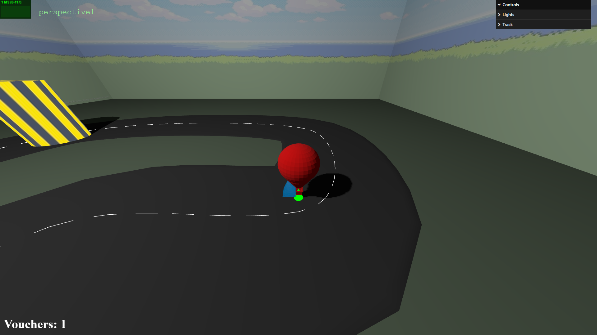

# Avoiding Stun by using Voucher

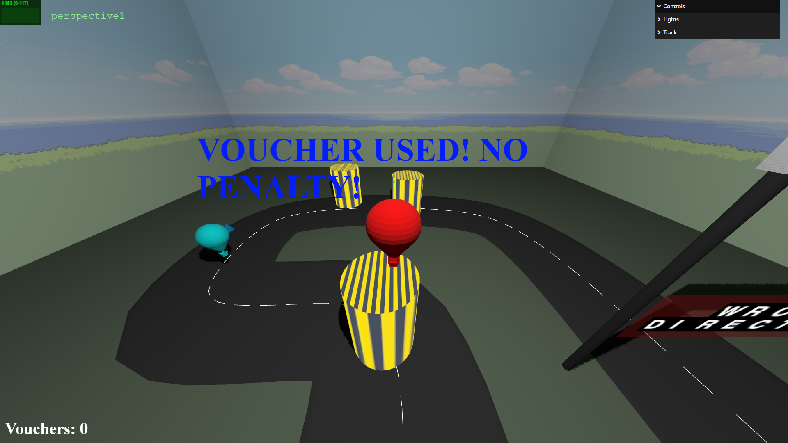

# Goal Line

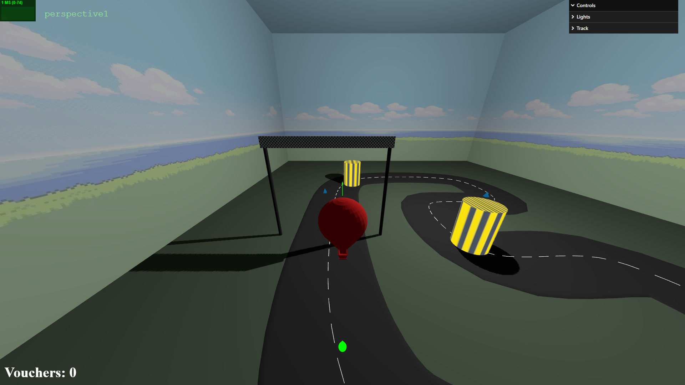

# Results

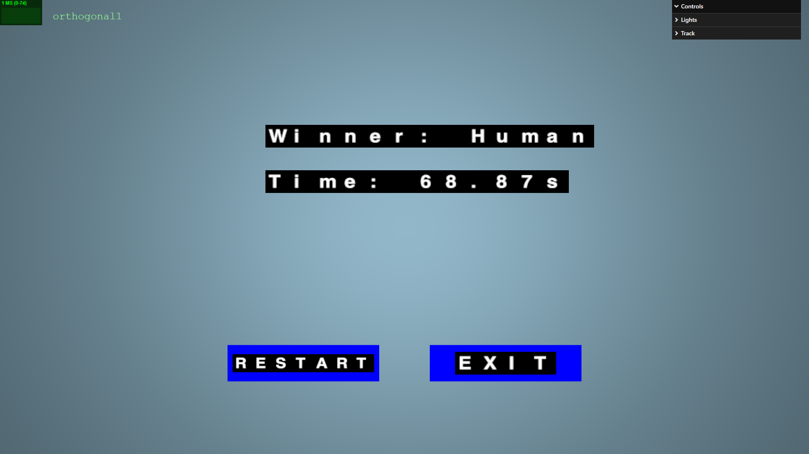

# GUI

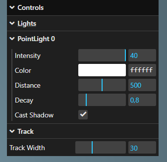